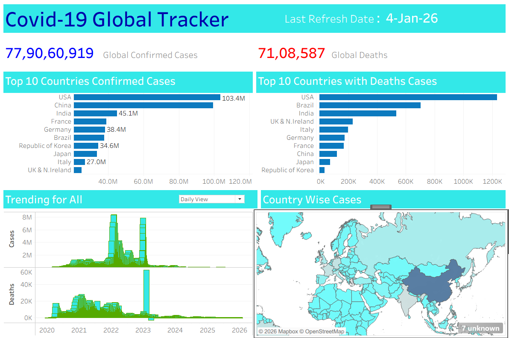

## 🌍 COVID-19 Global Tracker – (Tableau Capstone Project ) :-

## 📌 Project Overview

This project focuses on building an interactive Tableau dashboard using WHO COVID-19 Global Daily Data to analyze :
- Total COVID-19 cases
- Total COVID-19 deaths
- Trends over time
- Country-wise and region-wise impact
- The dashboard helps stakeholders understand the spread, severity, and patterns of COVID-19 using clear KPIs and visuals.

---

## 🎯 Project Objectives

* Track global confirmed COVID-19 cases & deaths
* Identify top affected countries
* Analyze daily trends over time
* Visualize country-wise impact on a world map
* Identify peak periods and trends

---

## 📂 Dataset Information  -->>>>

**Source** :  Kaggle (WHO COVID-19 Global Daily Data CSV Dataset)
* **File Used** : WHO-COVID-19-global-daily-data.csv

🔗 **[View CSV Dataset](https://github.com/dimple-shah-au13/COVID-19-Global-Tracker/blob/main/WHO-COVID-19-global-daily-data.csv)**

🔗 **[View Kaggle Dataset](https://www.kaggle.com/datasets/amadubarry/who-covid-19-global-cases-deaths)**

---

### Key Columns Included

* Date_reported
* Country
* Country_code
* WHO_region
* New_cases
* Cumulative_cases
* New_deaths
* Cumulative_deaths

---

## 🛠 Tools & Technologies Used

* Tableau Desktop
* CSV file (Kaggle = WHO COVID-19 data)
* Data Cleaning & Transformation
* Calculated Fields
* Interactive Dashboard Design
* Trend & KPI Analysis
* GitHub (Project Hosting)

---

## 🧹 Data Cleaning & Preparation (Tableau)

Verify data types:
Date_reported → Date
Cases & Deaths → Number

📌 Create Calculated Fields :

1️⃣ Total Cases
SUM([New_cases])

2️⃣ Total Deaths
SUM([New_deaths])

3️⃣ Swap calculation 
IF [Switch View] = 1 THEN "Daily View" ELSE "Cumulative View" END 

---

## 🔑 Key Performance Indicators (KPIs)

* 🌍 **Global Confirmed Cases** : 77,90,60,919
* ⚰️ **Global Deaths** : 71,08,587
* 🗓 **Data Range** : 2020 – 2026
* 🔄 **Last Refresh Date** : 4-Jan-2026

---

## 📈 Dashboard Visuals & Insights

## 1️⃣ Top 10 Countries by Cases

* **Visual**: Bar Chart
* **Metrics**: Country By New_cases

**Insights**:
* United States leads with over 103 million cases
* Followed by China, India, France, and Germany

## 2️⃣ Top 10 Countries by Cases

* **Visual**: Bar Chart
* **Metrics**: Country By New_deaths

**Insights**:
* United States has the highest death count
* Followed by Brazil, India, UK & Northern Ireland, and Italy
* COVID-19 cases peaked during multiple waves between 2020–2022

## 3️⃣ Cases & Deaths Over Time

* **Visual**: Bar Chart
* **Metrics**: Date_reported By New_deaths & New_cases

**Insights**:
* Major spikes observed during 2021–2022, representing peak pandemic waves
* Gradual decline after 2023 due to vaccinations and immunity buildup

## 4️⃣ Country-wise Total Cases

* **Visual**: Map
* **Metrics**: Country By New_deaths & New_cases

**Insights**:
* COVID-19 affected almost every country worldwide
* Higher concentration of cases in North America, Europe, and Asia
* USA, India, Brazil reported the highest cases and deaths

---

## 🎛 Filters & Interactivity

* Country Filter
* WHO Region Filter
* Date Range Filter
* Highlight Actions

---

## 📷 Dashboard Interaction -->>>>

🔗 **[View Raw Tableau Dashboard](https://github.com/dimple-shah-au13/COVID-19-Global-Tracker/blob/main/Covid-19-Global-Tracker.twbx)**

⚠️ Requires Tableau Desktop to open.

---

## 🔍 Business Recommendations

* Helps governments & organizations monitor pandemic impact
* Supports data-driven public health decisions
* Identifies high-risk regions
* Useful for policy planning and awareness

---

## 📷 Dashboard Preview 

Here’s a preview of the interactive dashboard:

---

🚀 How to Run This Project

- Download dataset from Kaggle
- Open Tableau Desktop
- Connect to WHO COVID-19 Global Daily Data.csv
- Load Covid-19-Global-Tracker.twbx
- Explore using filters & interactions

---

## 👤 Author

**Dimple Shah**
- Data Analyst | Excel | Power BI | Tableau | SQL | Python | Business Intelligence Enthusiast

---

## GITHUB -->>>>

🔗 <a href ="https://github.com/dimple-shah-au13/COVID-19-Global-Tracker/tree/main">GITHUB</a>

## ⭐ Support

If you like this project, don’t forget to ⭐ star the repository on GitHub!